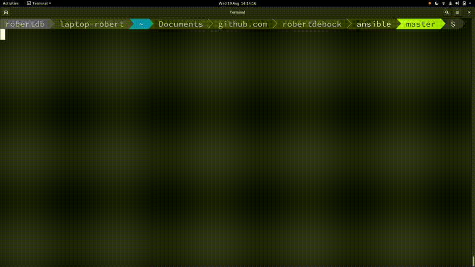
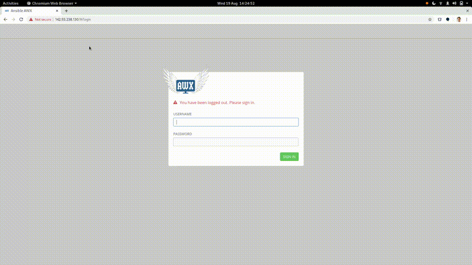
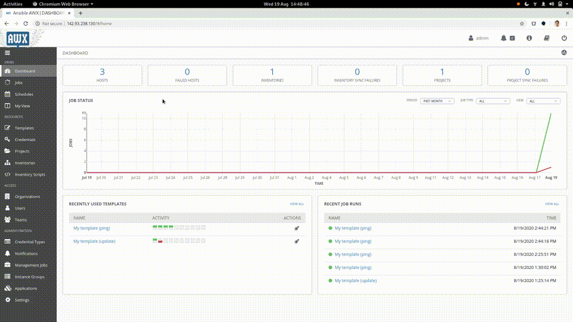

## Automation Journey

Follow along: http://robertdebock.nl/


---

# Who am I

Robert de Bock

---

## An automation tale

---

# What to automate

1. Make a list of job.
2. Rate job for "frequency" and "automation effort".
3. Decide.
4. CODE!

----

# List of jobs

Think of a few jobs that you'd like to automate.

----

## Suggestion of jobs

- Applying patches.
- Adding disks.
- Install component x.
- Update component x.

----

# Rate jobs

- 1: not frequent, low effort.
- 10: super frequent, high effort.

----

# Rated jobs

|job           |frequency|automation effort|
|--------------|---------|-----------------|
|OS patches    |9        |3                |
|Disk expansion|3        |9                |
|Install X     |3        |4                |
|Update X      |2        |3                |

----

# Decide

OS patching: occurs all the time and seems easy to automate.

When automated, you can focus on [better things](https://www.google.com/search?q=how+to+contribute+to+open+source).

----

# CODE!

This heavily depends on the tooling available.

(But you can also introduce new tools!)

----

# CRUD

Almost all "jobs" should facilitate:

1. Create.
2. Read.
3. Update.
4. Delete.

----

# Ansible

----

# Reuse code

[https://galaxy.ansible.com/](https://galaxy.ansible.com/search?keywords=update%20&order_by=-relevance&page=1&deprecated=false&type=role)

----

# Make a playbook

```yaml
- name: apply patches
  hosts: all
  become: yes
  gather_facts: no

  roles:
    - role: robertdebock.bootstrap
    - role: robertdebock.update
```

----

# Dry run

```shell
ansible-playbook update.yml \
  --inventory 134.209.84.15, \
  --user root \
  --check
```

----



----

# Try it

```shell
ansible-playbook update.yml \
   --inventory 134.209.84.15,
```

----

# Run it

Fill the file `inventory` with all hosts.

```shell
ansible-playbook update.yml
```

---

# Almost there

Automation has saved you time, cool!

PS: Not everybody loves the command line.

----

### How can you do even less?

----

## Scheduling automation

For example `cron`, [awx](https://github.com/ansible/awx/) or [rundeck](https://www.rundeck.com/open-source).

- Limitations?

----

## Let others do it. (&trade;)

Much better, but what if your collegue is on a holiday?

----

# Do it yourself!

----

# AWX

A webui and API that can run playbooks on hosts.

----



----



----

- URL: http://142.93.238.130/

----

# Have fun!

- username: admin
- password: robertdebock

----

# Ping and Update

https://github.com/robertdebock/ansible

---

# How to organize

----

## By product and service

For example:

- Operating system team
- Backup & Restore team
- Monitoring team
- Compliance team
- Orchestration

---

# How to develop

- Choose a language
- Train people
- Organize learning sessions
- Invite people from another team

----

# Mindset

All teams must offer an API to allow self-service capabilities for their product or service.

---

# Caveats

- Not "free".
- Teams may isolate.
- Dependency management.

---

# Conclusion

1. Automation allows scaling.
2. Automation brings predictability.
3. May require re-organizing teams.
